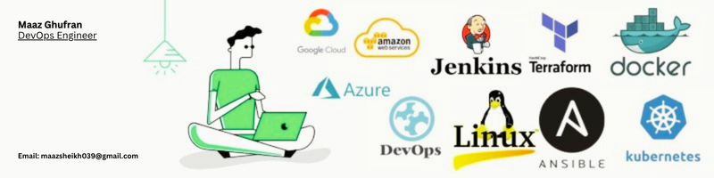
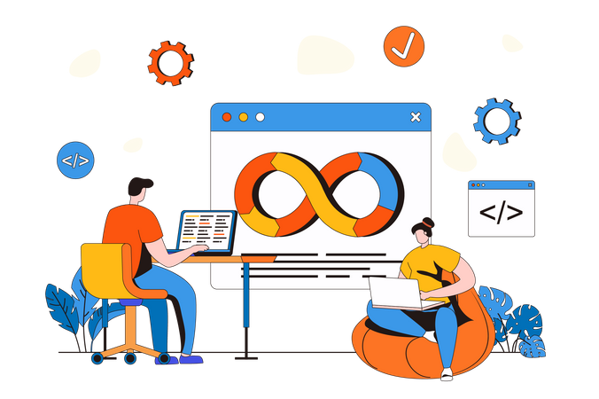

 

  

# 👋 Hi, I'm Maaz!

  

  
  
  

---

### 📖 About Me

<table border="0">
  <tr>
    <td width="60%" valign="center">
      I'm a passionate <b>AIOps & AI-Driven Automation Engineer</b> from Karachi 🇵🇰, currently expanding my expertise in modern cloud infrastructure and automated workflows through the <b>AIOps Level 6 Diploma</b> at <b>Al Nafi</b>. My mission is to build scalable, secure, and highly automated systems using AI and the best practices in Cloud Computing.
     I don't just build the cloud; I build the brain that manages the cloud.
    </td>
    <td width="50%" align="center">
      
    </td>
  </tr>
</table>

---

### 🚀 Technical Skills & Al Nafi Curriculum Journey

<table width="100%">
  <tr>
    <th align="left" width="25%">Domain</th>
    <th align="left" width="75%">Tools, Technologies & Frameworks</th>
  </tr>
  <tr>
    <td><strong>💻 Programming & Automation</strong></td>
    <td>
      
      
      
      
      
    </td>
  </tr>
  <tr>
    <td><strong>🏗️ DevOps & IaC</strong></td>
    <td>
      
      
      
      
      
      
      
    </td>
  </tr>
  <tr>
    <td><strong>🤖 AI & Machine Learning</strong></td>
    <td>
      
      
      
      
      
    </td>
  </tr>
  <tr>
    <td><strong>☁️ Multi-Cloud Architecture</strong></td>
    <td>
      
      
      
      
    </td>
  </tr>
  <tr>
    <td><strong>🛡️ Cyber Security & SIEM</strong></td>
    <td>
      
      
      
      
      
    </td>
  </tr>
  <tr>
    <td><strong>🐧 Systems & GitOps</strong></td>
    <td>
      
      
      
      
    </td>
  </tr>
</table>

---

 

  <h2>🌐 Connect with Me</h2>
  
Let's collaborate and build something amazing together!

  
  
  &nbsp;
  
  &nbsp;
  
  &nbsp;
  
  &nbsp;
  

 
<!-- 

  

 -->

---

### 📊 GitHub Analytics

  
  

  

---

### 🐍 GitHub Contribution Snake Animation

  

---

  <table border="1" cellspacing="0" cellpadding="0" style="border-collapse: collapse; border: 1px solid #333;">
    <tr>
      <td align="center" style="padding: 10px;">
        <!-- v=3 lagane se naya graph foran nazar aayega -->
        
      </td>
    </tr>
  </table>

---

### 💬 Favorite Quote

  

