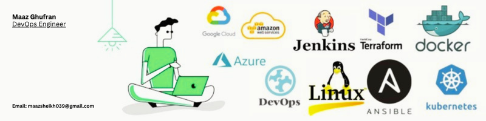

<p align="center">
  
</p>

<h1 align="center">👋 Hi, I'm Maaz Ghufran</h1>

<p align="center">
  
</p>

<p align="center">
  <a href="https://www.linkedin.com/in/maaz-ghufran-777mz/">
    
  </a>
  <a href="https://github.com/maazsheikh039">
    
  </a>
  <a href="https://x.com/maazsheikh039">
    
  </a>
</p>

---

## 👨‍💻 About Me

I'm an aspiring **AIOps / DevOps Engineer** from Karachi, Pakistan, focused on building reliable, automated and intelligent infrastructure.

I'm currently developing my skills across **Linux, Python, Cloud Computing, DevOps, Infrastructure as Code, Monitoring, Automation and AI** through hands-on labs and projects.

My long-term goal is to work at the intersection of:

**☁️ Cloud + ⚙️ DevOps + 🛡️ Security + 🤖 AI**

> **"I don't just want to manage infrastructure — I want to build intelligent systems that can observe, automate and improve it."**

---

## 🎯 Current Focus

```text
🐧 Linux & System Administration
🐍 Python & Bash Automation
🐳 Docker & Containerization
☸️ Kubernetes
☁️ AWS & Cloud Infrastructure
🏗️ Terraform & Infrastructure as Code
⚙️ Ansible & Configuration Management
📊 Prometheus & Grafana
🔄 CI/CD & GitHub Actions
🤖 AI / ML / AIOps
🛡️ DevSecOps & Cloud Security
```

---

## 🛠️ Technical Skills

### 💻 Programming & Automation

<p>
  
  
  
</p>

### 🐧 Linux & Systems

<p>
  
  
  
  
  
</p>

### ⚙️ DevOps & Infrastructure

<p>
  
  
  
  
  
  
</p>

### ☁️ Cloud

<p>
  
  
</p>

### 📊 Monitoring & Observability

<p>
  
  
  
  
</p>

### 🤖 AI & Machine Learning

<p>
  
  
  
  
  
</p>

### 🛡️ Security

<p>
  
  
  
  
</p>

---

## 🚀 Featured Projects

> I believe practical projects are more valuable than simply listing technologies.

### 🐳 Dockerized Application

**Technologies:** Docker · Linux · Python

* Containerized application deployment
* Docker images and containers
* Environment configuration
* Networking and persistent storage

🔗 **Repository:** Coming Soon

---

### ⚙️ Infrastructure Automation with Ansible

**Technologies:** Ansible · Linux · Bash

* Automated Linux configuration
* User and permission management
* Package installation
* Service configuration
* Repeatable infrastructure setup

🔗 **Repository:** Coming Soon

---

### ☁️ AWS Infrastructure with Terraform

**Technologies:** AWS · Terraform · Linux

* Infrastructure as Code
* Automated AWS resource provisioning
* Configuration management
* Reproducible cloud environments

🔗 **Repository:** Coming Soon

---

### 📊 Infrastructure Monitoring

**Technologies:** Prometheus · Grafana · Docker

* System metrics collection
* Infrastructure monitoring
* Dashboard creation
* Alerting and observability

🔗 **Repository:** Coming Soon

---

### 🤖 AI-Powered Infrastructure Automation

**Technologies:** Python · AI/ML · Linux · DevOps

Exploring intelligent automation systems that can analyze infrastructure information, detect anomalies and assist with operational tasks.

🔗 **Repository:** Coming Soon

---

## 📚 Currently Learning

| Area             | Focus                                |
| ---------------- | ------------------------------------ |
| 🐧 Linux         | Administration, Networking, Security |
| 🐳 Docker        | Containers, Images, Networking       |
| ☸️ Kubernetes    | Workloads, Services, Deployments     |
| 🏗️ Terraform    | Infrastructure as Code               |
| ⚙️ Ansible       | Configuration & Automation           |
| ☁️ AWS           | Cloud Architecture & Services        |
| 📊 Observability | Prometheus, Grafana, Elasticsearch   |
| 🤖 AI            | ML, LLMs, AI Agents, AIOps           |
| 🛡️ Security     | Cloud Security & DevSecOps           |

---

## 🧠 My Learning Path

```text
Linux
  ↓
Python + Bash
  ↓
Git + GitHub
  ↓
Docker
  ↓
Ansible
  ↓
AWS
  ↓
Terraform
  ↓
Kubernetes
  ↓
CI/CD
  ↓
Monitoring & Observability
  ↓
DevSecOps
  ↓
AIOps + AI Automation
  ↓
AI Engineer / DevSecOps Engineer
```

---

## 📊 GitHub Analytics

<p align="center">
  
  
</p>

<p align="center">
  
</p>

---

## 🐍 Contribution Snake

<p align="center">
  
</p>

---

## 💡 Engineering Philosophy

<p align="center">

> **Learn → Build → Automate → Monitor → Secure → Improve**

</p>

I focus on turning theoretical knowledge into practical systems through continuous experimentation, automation and real-world projects.

---

## 🌐 Connect With Me

<p align="center">
  <a href="https://www.linkedin.com/in/maaz-ghufran-777mz/">
    
  </a>
  &nbsp;
  <a href="https://github.com/maazsheikh039">
    
  </a>
  &nbsp;
  <a href="https://x.com/maazsheikh039">
    
  </a>
</p>

<p align="center">
  <b>Let's build, automate and learn together. 🚀</b>
</p>

---

<p align="center">
  <i>"Automation is not about replacing people. It's about removing repetitive work so people can focus on creating."</i>
</p>
