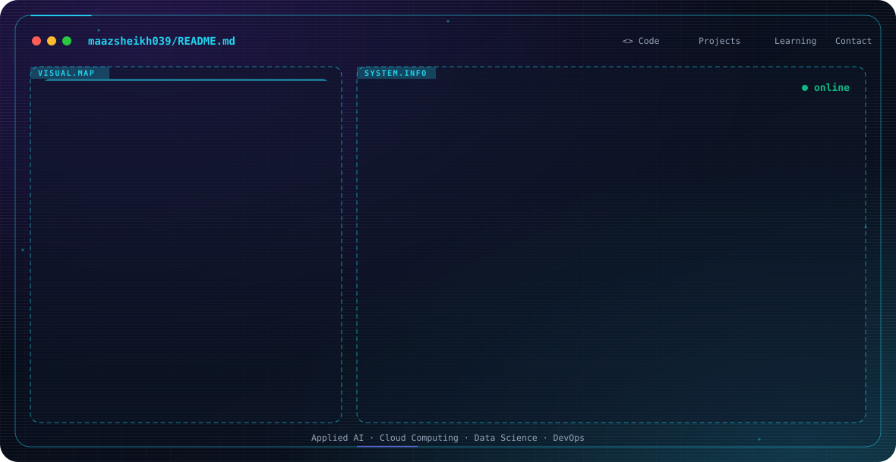

<div align="center">

<picture>
  <source media="(prefers-color-scheme: dark)" srcset="./dark.svg">
  <source media="(prefers-color-scheme: light)" srcset="./light.svg">
  
</picture>

<h1>Maaz Ghufran</h1>

<p><b>Aspiring Applied AI Engineer</b><br>
AI · Cloud Computing · Data Science · DevOps</p>

<p>
  <a href="https://www.linkedin.com/in/maaz-ghufran-777mz/"></a>
  <a href="https://github.com/maazsheikh039"></a>
  <a href="https://x.com/maazsheikh039"></a>
</p>

</div>

---

## About

I'm an aspiring **Applied AI Engineer** based in Karachi, Pakistan. I'm interested in taking AI out of notebooks and into reliable, deployed systems.

My work spans **AI / machine learning, data science and cloud computing**, built on a DevOps foundation of Linux, automation, containers and infrastructure as code. I learn through hands-on labs and projects.

> *"I don't just want to manage infrastructure — I want to build intelligent systems that can observe, automate and improve it."*

## Focus Areas

| Area | What I work on |
| --- | --- |
| **Applied AI** | Machine learning, deep learning, NLP, computer vision, AI automation |
| **Data Science** | Data analysis and data-driven problem solving |
| **Cloud Computing** | AWS, cloud architecture, Terraform |
| **DevOps & Automation** | Linux, Docker, Ansible, CI/CD with GitHub Actions |
| **Observability** | Prometheus, Grafana, Elasticsearch, Kibana |
| **Security** | Linux security, cloud security, DevSecOps |

## Tech Stack

**AI, ML & Data**

      

**Cloud & Infrastructure**

     

**Linux, Automation & Tooling**

      

**Monitoring & Security**

       

## Projects

Hands-on projects I'm building to turn what I learn into working systems. Repositories will be linked as they are published.

| Project | Stack | What it covers | Status |
| --- | --- | --- | --- |
| **AI-Powered Infrastructure Automation** | Python · AI/ML · Linux · DevOps | Intelligent automation that analyzes infrastructure data, detects anomalies and assists with operational tasks | In progress |
| **AWS Infrastructure with Terraform** | AWS · Terraform · Linux | Infrastructure as code, automated resource provisioning, reproducible cloud environments | In progress |
| **Infrastructure Monitoring** | Prometheus · Grafana · Docker | Metrics collection, dashboards, alerting and observability | In progress |
| **Infrastructure Automation with Ansible** | Ansible · Linux · Bash | Automated Linux configuration, users and permissions, packages, services | In progress |
| **Dockerized Application** | Docker · Linux · Python | Containerized deployment, images, environment configuration, networking and storage | In progress |

## Currently Learning

| Area | Focus |
| --- | --- |
| AI / ML | ML, LLMs, AI agents, AIOps |
| Data Science | Data analysis and modeling |
| AWS | Cloud architecture and services |
| Kubernetes | Workloads, services, deployments |
| Terraform | Infrastructure as code |
| Ansible | Configuration and automation |
| Observability | Prometheus, Grafana, Elasticsearch |
| Security | Cloud security and DevSecOps |

<details>
<summary><b>My learning path</b></summary>

```text
Linux → Python + Bash → Git + GitHub → Docker → Ansible → AWS → Terraform
→ Kubernetes → CI/CD → Monitoring & Observability → DevSecOps
→ AIOps + AI Automation → Applied AI Engineer
```

</details>

## GitHub Activity

<p align="center">
  
</p>

<p align="center">
  
</p>

## Engineering Philosophy

**Learn → Build → Automate → Monitor → Secure → Improve**

I focus on turning theory into practical systems through continuous experimentation, automation and real-world projects.

---

<p align="center">
  <i>"Automation is not about replacing people. It's about removing repetitive work so people can focus on creating."</i>
</p>
